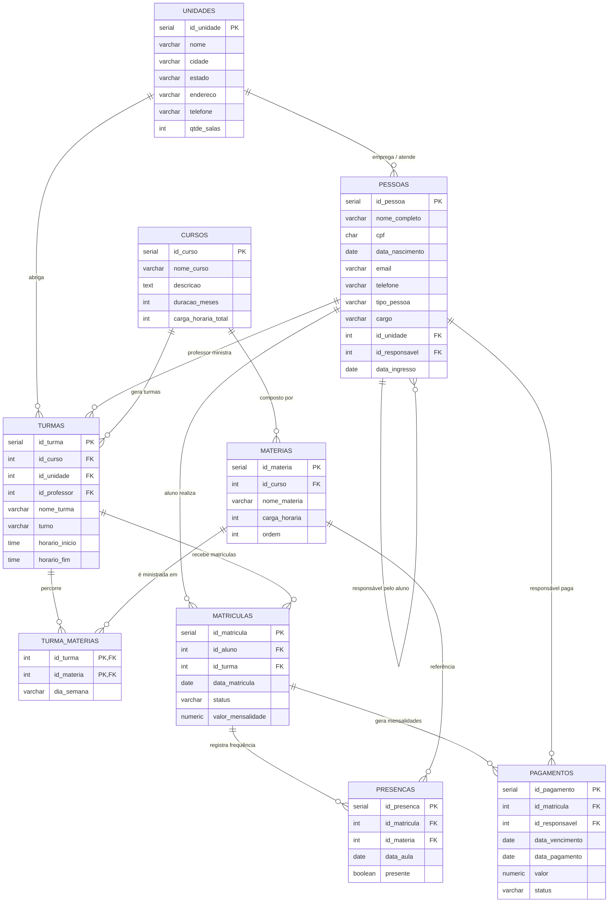

# Escola Megamente - Unidade Porto Velho

Banco de dados relacional desenvolvido com **PostgreSQL** para a gestão acadêmica, operacional e financeira da **Escola Megamente (Unidade Porto Velho)**.

## Apresentação do Projeto

### Tema
Sistema de banco de dados para uma **escola de tecnologia e robótica para crianças e adolescentes**, utilizando metodologia STEAM (programação, desenvolvimento de games, robótica e criação de apps).

### Objetivo Geral
Centralizar em um único modelo relacional todas as informações do dia a dia da escola: cadastro de unidades, pessoas (alunos, responsáveis, professores e funcionários), o curso único com suas matérias, turmas, matrículas, controle de presença e pagamentos de mensalidades. O objetivo é dar suporte completo à **equipe pedagógica** (matrículas, turmas e frequência) e à **administração financeira** (mensalidades e status de pagamento).

### Público-Alvo
- **Equipe pedagógica**: professores e coordenadores, que controlam turmas, matérias e presença dos alunos.
- **Secretaria / administração**: responsáveis pelo cadastro de alunos e responsáveis, matrículas, turmas e funcionários.
- **Setor financeiro**: acompanhamento e baixa dos pagamentos de mensalidades por parte dos responsáveis.
- **Responsáveis (pais/guardians)**: único responsável legal e financeiro por aluno, conforme contrato.

### Contexto Real da Escola
A escola possui **mais de uma unidade espalhada pelo Brasil**. Este projeto modela a unidade de **Porto Velho/RO**, que conta com **1 sala de aula**, **1 professor** responsável pelo curso completo e **3 turmas** (manhã, tarde e noite). O curso é único — **Formação Megamente** — e é composto por **8 matérias** que a turma percorre integralmente. As aulas são **presenciais**.

---

## Estrutura do Repositório

```
escola-megamente-porto-velho/
├── README.md
└── scripts/
    ├── 001__create_database_escola_megamente.sql
    ├── 002__create_table_unidades.sql
    ├── 003__create_table_pessoas.sql
    ├── 004__create_table_cursos.sql
    ├── 005__create_table_materias.sql
    ├── 006__create_table_turmas.sql
    ├── 007__create_table_turma_materias.sql
    ├── 008__create_table_matriculas.sql
    ├── 009__create_table_presencas.sql
    ├── 010__create_table_pagamentos.sql
    ├── 011__insert_into_unidades_e_pessoas.sql
    ├── 012__insert_into_cursos_e_materias.sql
    ├── 013__insert_into_turmas.sql
    ├── 014__insert_into_turma_materias.sql
    ├── 015__insert_into_matriculas.sql
    ├── 016__insert_into_presencas.sql
    ├── 017__insert_into_pagamentos.sql
    ├── 018__update_dados_exemplo.sql
    ├── 019__delete_dados_exemplo.sql
    ├── 020__create_view_alunos_matriculados.sql
    ├── 021__create_view_pagamentos_pendentes.sql
    └── 022__create_or_replace_procedure_atualiza_status_pagamentos.sql
```

### Regra de nomes
Todos os scripts seguem o padrão `[Versão]__[acao]_[descricao/objeto].sql`:

- `001__` a `010__` → DDL: criação do banco e das tabelas (`CREATE TABLE IF NOT EXISTS`)
- `011__` a `017__` → DML: inserção de dados de exemplo (`INSERT ... ON CONFLICT DO NOTHING`)
- `018__` e `019__` → DML: `UPDATE` e `DELETE` para validar o comportamento do banco
- `020__` e `021__` → `CREATE OR REPLACE VIEW`
- `022__` → `CREATE OR REPLACE PROCEDURE`

> **Dica:** todos os scripts podem ser executados múltiplas vezes sem erro (uso de `IF NOT EXISTS` e `ON CONFLICT DO NOTHING`).

---

## Modelo de Dados Relacional



### Decisões de modelagem
- **1 curso único** ("Formação Megamente") com **8 matérias**, percorridas integralmente por todas as turmas (tabela associativa `turma_materias`).
- **1 professor** vinculado a todas as turmas; **funcionários e professores** estão na mesma tabela `pessoas`, diferenciados por `tipo_pessoa`/`cargo`.
- **1 responsável por aluno** (responsável legal e financeiro do contrato), modelado como auto-relacionamento em `pessoas.id_responsavel`.
- Cada unidade possui **1 sala** (`qtde_salas = 1`); em Porto Velho existem **3 turmas** (manhã, tarde e noite) dividindo a única sala.
- Controle de **matrículas, presença e pagamentos de mensalidade**. O modelo suporta múltiplas unidades no Brasil.

---

## Como Executar no pgAdmin

1. Abra o **pgAdmin** e conecte-se ao servidor PostgreSQL.
2. Crie o banco `escola_megamente` (botão direito em *Databases* → *Create* → *Database...*).
3. Abra o **Query Tool** (botão direito no banco `escola_megamente` → *Query Tool*).
4. Abra e execute os scripts **em ordem numérica** (001 → 022), dentro da pasta `scripts/`:

| Ordem | Script | Ação |
|---|---|---|
| `001` | `create_database_escola_megamente.sql` | Guia de criação do banco (ou crie via GUI) |
| `002`–`010` | `create_table_*.sql` | Criação das 9 tabelas (DDL) |
| `011`–`017` | `insert_into_*.sql` | Dados de exemplo (DML – INSERT) |
| `018` | `update_dados_exemplo.sql` | Validação de UPDATE |
| `019` | `delete_dados_exemplo.sql` | Validação de DELETE e chaves estrangeiras |
| `020`–`021` | `create_view_*.sql` | Views: alunos matriculados e pagamentos pendentes |
| `022` | `create_or_replace_procedure_*.sql` | Procedure de atualização de status |

5. Execute a procedure criada para marcar mensalidades vencidas como atrasadas:

```sql
CALL proc_atualiza_status_pagamentos();
```

6. Consulte as views:

```sql
SELECT * FROM view_alunos_matriculados;
SELECT * FROM view_pagamentos_pendentes;
```

> **Dica:** os scripts DDL usam `CREATE TABLE IF NOT EXISTS` e os DML usam `ON CONFLICT DO NOTHING`, permitindo executá-los múltiplas vezes sem erro.