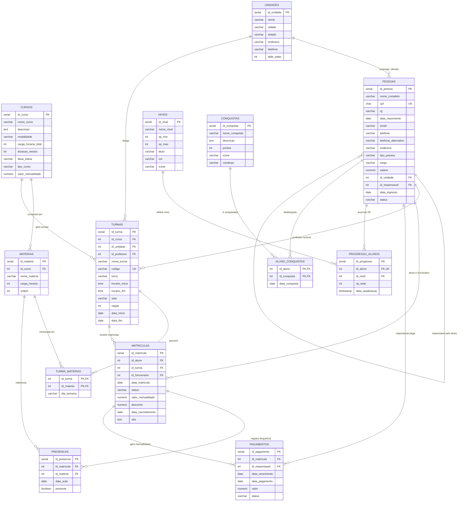

# Escola Megamente - Banco de Dados (Unidade Porto Velho)

Trabalho da disciplina de banco de dados feito com **PostgreSQL** + **PgAdmin**.

## Identificação do grupo

- **Grupo:** G2-04
- **Banco de dados:** db18
- **Usuário de acesso:** aluno18
- **Host de conexão:** core_pgafya

### Integrantes

- MATHEUS DE VASCONCELLOS BARBOSA
- NICOLAS DE LAIA FERREIRA FONSECA
- JOÃO PEDRO MENDES DE QUEIROZ
- LUCAS FELIPE
- NICOLAS MOURA BATISTA DE LACERDA

---

O tema escolhido foi a **Escola Megamente**, uma escola de programação,
robótica e games para crianças e adolescentes, que trabalha a metodologia
STEAM. Modelei a unidade de **Porto Velho/RO**.

## Apresentação

A escola tem mais de uma unidade espalhada pelo Brasil, então comecei criando
uma tabela de unidades — dá pra cadastrar outras unidades depois sem mexer no
resto.

Na unidade de Porto Velho tem **1 sala de aula só**, **1 professor** e **3
turmas** (manhã, tarde e noite) que se revezam na sala. O curso é único: a
**Formação Megamente**, com **8 matérias**. As turmas passam por todas as
matérias durante o curso. As aulas são presenciais.

### Objetivo

Organizar num banco só as coisas do dia a dia da escola:

- cadastro de alunos, responsáveis, professor e funcionários;
- turmas e as matérias do curso;
- matrículas (com valor e desconto);
- presença das aulas;
- pagamentos das mensalidades (quem paga é o responsável).

Assim a secretaria e o financeiro não dependem mais de planilha.

## Inovação: Gamificação 🎮

Adicionei **gamificação** pra engajar alunos e famílias: o aluno acumula **XP**
participando das aulas (25 XP por presença) e desbloqueando **conquistas**,
subindo de **nível** (de *Iniciante* até *Mestre Megamente*) dentro de um
**ranking** da unidade.

Como funciona:

- **Níveis** — faixas de XP com títulos e cores (Iniciante, Aprendiz,
  Explorador, Criador, Mestre Megamente);
- **Conquistas** — medalhas com pontos de XP (ex.: *Frequência Perfeita*,
  *Mestre em Programação*);
- **Progresso do aluno** — XP acumulado + nível atual de cada aluno
  (relação 1 pra 1);
- **Ranking** — a view `view_ranking_alunos` mostra a posição de cada aluno,
  ordenada pelo XP;
- **Procedure `proc_recalcula_xp_alunos`** — recalcula o XP de todos a partir
  das presenças somadas às conquistas e reajusta o nível automaticamente.
  Basta rodar `CALL proc_recalcula_xp_alunos()`.

Isso deixa a escola mais atrativa pro público (crianças e adolescentes) e usa
dados que já existiam (presenças) pra gerar engajamento — sem depender de
planilha.

### Público-alvo

- **Secretaria** — cadastro de alunos, responsáveis, turmas e matrículas;
- **Professor** — lançar a presença das aulas;
- **Financeiro** — ver quem está devendo mensalidade;
- **Direção** — acompanhar quantos alunos tem em cada turma.

## Como eu modelei

- juntei aluno, responsável, professor e funcionário numa tabela **pessoas**
  só, pra não repetir nome/cpf/telefone em quatro tabelas parecidas;
- cada aluno tem **1 responsável** (é quem assina o contrato e paga a
  mensalidade) — apontado pelo campo `id_responsavel`;
- a **turma** pertence a uma unidade e a um curso, e tem o professor;
- a turma liga com as **8 matérias** pela tabela `turma_materias`;
- a **matrícula** guarda o valor e um possível desconto (ex.: desconto de
  irmão);
- a **presença** é registrada por matrícula + matéria + data da aula;
- o **pagamento** é da matrícula e quem paga é o responsável.

### Modelo de dados (diagrama)



## Estrutura dos arquivos

```
├── README.md
├── prototipo/                              (protótipo da interface - HTML/CSS)
│   ├── login.html                          (tela de login)
│   ├── index.html                          (tela principal / dashboard)
│   ├── pessoas.html                        (gerenciamento de pessoas)
│   ├── gamificacao.html                    (ranking e conquistas)
│   └── assets/
│       ├── style.css                       (estilo do protótipo)
│       └── app.js                          (interações do protótipo)
└── scripts/
    ├── 001__create_database_escola_megamente.sql   (guia de criação do banco)
    ├── 002__create_table_unidades.sql              (criação das tabelas - DDL)
    ├── 003__create_table_pessoas.sql
    ├── 004__create_table_cursos.sql
    ├── 005__create_table_materias.sql
    ├── 006__create_table_turmas.sql
    ├── 007__create_table_turma_materias.sql
    ├── 008__create_table_matriculas.sql
    ├── 009__create_table_presencas.sql
    ├── 010__create_table_pagamentos.sql
    ├── 011__insert_into_unidades_e_pessoas.sql     (dados de exemplo - DML)
    ├── 012__insert_into_cursos_e_materias.sql
    ├── 013__insert_into_turmas.sql
    ├── 014__insert_into_turma_materias.sql
    ├── 015__insert_into_matriculas.sql
    ├── 016__insert_into_presencas.sql
    ├── 017__insert_into_pagamentos.sql
    ├── 018__update_dados_exemplo.sql               (teste do UPDATE)
    ├── 019__delete_dados_exemplo.sql               (teste do DELETE)
    ├── 020__create_view_alunos_matriculados.sql    (views)
    ├── 021__create_view_pagamentos_pendentes.sql
    ├── 022__create_or_replace_procedure_atualiza_status_pagamentos.sql
    ├── 023__create_table_niveis.sql                (INOVAÇÃO: gamificação - DDL)
    ├── 024__create_table_conquistas.sql
    ├── 025__create_table_progresso_alunos.sql
    ├── 026__create_table_aluno_conquistas.sql
    ├── 027__insert_into_niveis.sql                 (INOVAÇÃO: gamificação - DML)
    ├── 028__insert_into_conquistas.sql
    ├── 029__insert_into_progresso_alunos.sql
    ├── 030__insert_into_aluno_conquistas.sql
    ├── 031__create_view_ranking_alunos.sql         (INOVAÇÃO: gamificação - view)
    └── 032__create_or_replace_procedure_recalcula_xp_alunos.sql
```

## Execução

Os scripts estão numerados na ordem de execução (001 ao 032). Eles podem ser
rodados mais de uma vez sem erro, porque as tabelas usam `CREATE TABLE IF NOT
EXISTS` e os inserts usam `ON CONFLICT DO NOTHING`.

Os scripts de gamificação (023 ao 032) criam as tabelas novas, inserem os
níveis/conquistas/progresso iniciais e geram a view de ranking e a procedure
de XP. Pra validar, roda:

```sql
SELECT * FROM view_ranking_alunos;          -- posição de cada aluno
SELECT * FROM view_alunos_matriculados;    -- view já existente
CALL proc_recalcula_xp_alunos();           -- recalcula XP e níveis
```

## Protótipo da interface

A pasta `prototipo/` tem uma versão simples da interface (HTML/CSS/JS) pra
visualizar como as pessoas usariam o sistema:

- **login.html** — acesso de secretaria, professor e direção;
- **index.html** — tela principal com os números da escola (dashboard);
- **pessoas.html** — gerenciamento de cadastro de pessoas;
- **gamificacao.html** — ranking e conquistas (a inovação).

Basta abrir o `login.html` no navegador — o protótipo é estático, com dados de
exemplo iguais aos do banco.

## Anotações / o que eu aprendi

- o `CREATE DATABASE` do Postgres **não tem** `IF NOT EXISTS`, por isso o
  script `001` é mais um guia do que um script de fato;
- se tentar apagar um responsável que tem aluno apontando pra ele, o banco
  recusa (chave estrangeira) — deixei um exemplo disso comentado no `019`;
- coloquei `salario` na tabela de pessoas, mas ele só é preenchido pra
  professor e funcionários (restrição `CHECK`);
- os CPFs, e-mails e endereços dos dados de exemplo são **fictícios**;
- na gamificação o XP é calculado assim: **presenças × 25 + pontos das
  conquistas**, e o nível vem da faixa de XP (ver script `032`).
